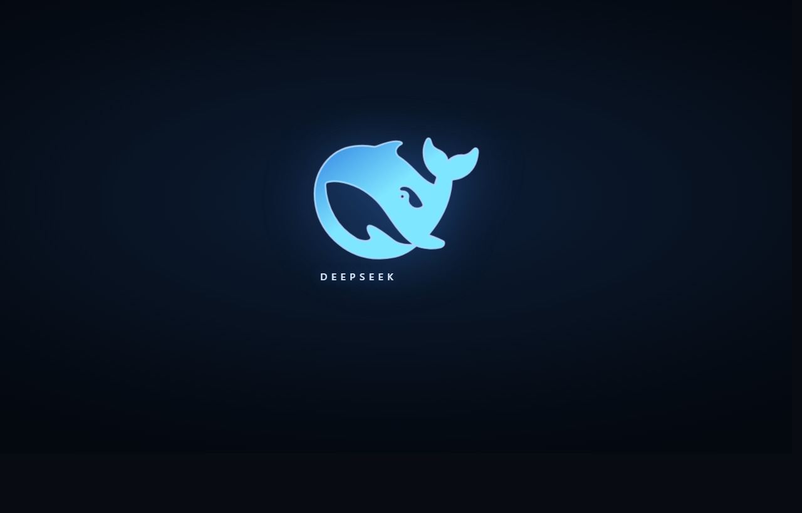
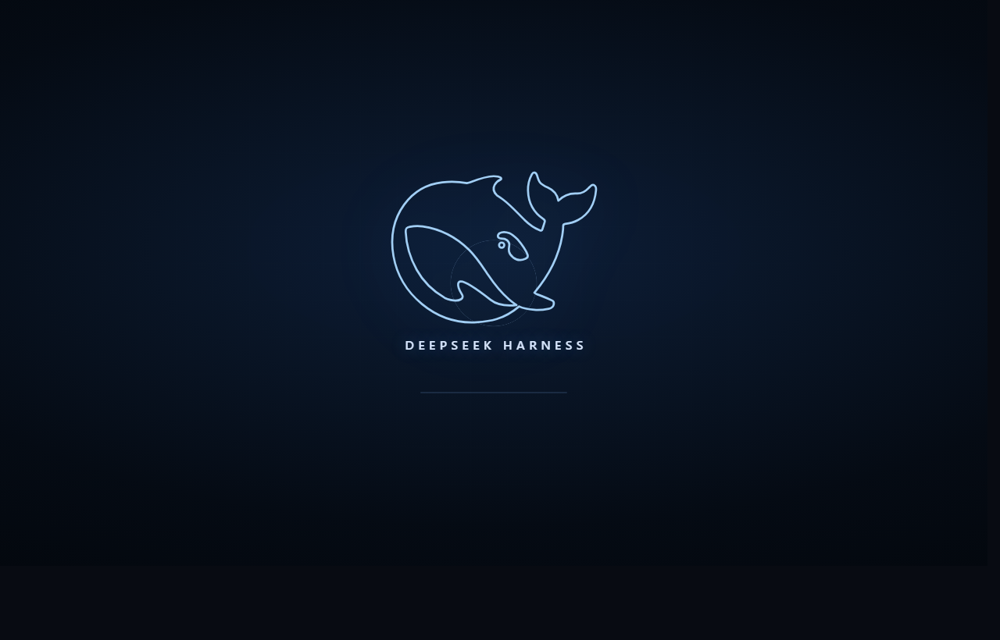
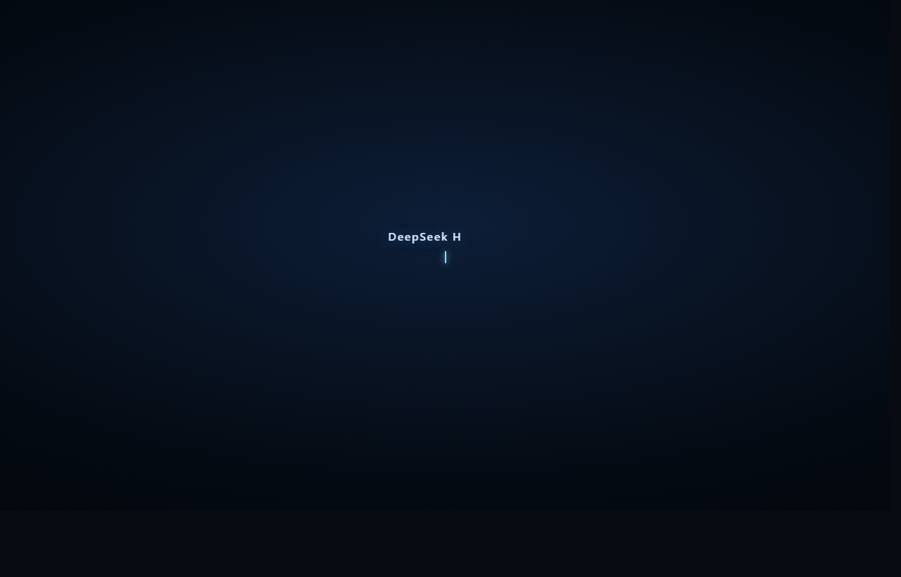
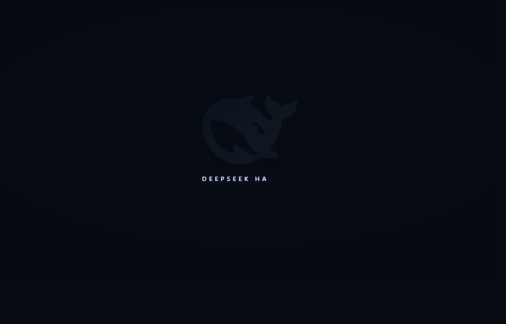
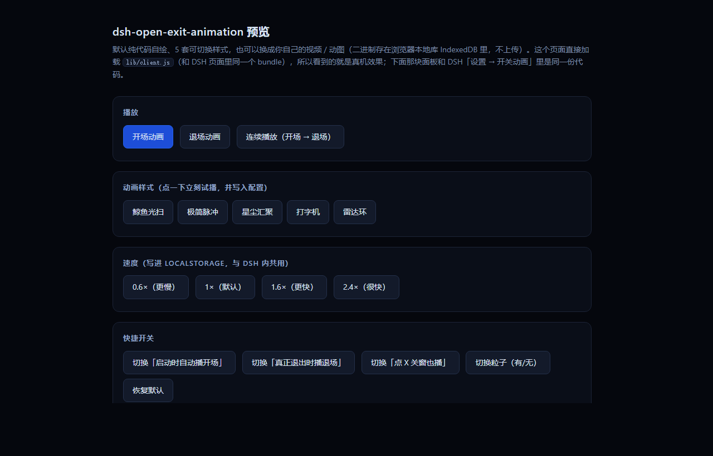

# dsh-open-exit-animation

给 DeepSeek Harness 的**开场 + 退场**动画插件。默认纯代码自绘（CSS/SVG + 自定义属性粒子），**零视频素材**，
也可以换成你自己的视频 / 动图（二进制存在浏览器本地库，不上传、不联网）：

- **开场**：DSH 启动、页面就绪后自动播一次（默认样式约 2.26s）。
- **退场（真正关闭时）**：**托盘右键 → 退出 / 退出应用**时，桌面壳会先把窗口亮出来（点过 X 后它在托盘里藏着），
  `await globalThis.__dshExitAnimation()` 播完退场动画再真正退出（默认约 1.42s）。
- **点窗口 X**：默认**不播动画**，直接隐藏到托盘（跟没装插件一样）。想让它也播，就在面板里打开
  「**点 X 关窗也播**」（对应配置 `exitOnClose`）——补丁在 close 收尾里问的是 `globalThis.__dshCloseAnimation()`，
  播不播由页面按配置决定，不用重打补丁。

**5 套可切换样式**，全部在设置页里即时改、即时试播：

| 样式 id | 名字 | 长什么样 |
| --- | --- | --- |
| `whale` | 鲸鱼光扫（默认） | 鲸鱼标志描边自绘 → 光扫掠过 → 粒子汇聚 → 字标浮现 |
| `pulse` | 极简脉冲 | 实心鲸鱼 + 3 圈呼吸扩散，克制、短（1.9s / 1.2s） |
| `stardust` | 星尘汇聚 | 无标志，54 粒子向中心核汇聚成字（2.4s / 1.5s） |
| `typewriter` | 打字机 | 无标志，光标 + 扫描线逐字打出（2.1s / 1.1s） |
| `rings` | 雷达环 | 描边鲸鱼 + 网格 + 3 圈雷达扫过（2.0s / 1.3s） |

除样式外还可调：**速度**（0.5–3×）、**粒子数**（0–60）、**主色**（7 个预设 + 任意取色）、
**三段文案**（字标 / 开场副标题 / 退场副标题）。

## 截图

| 开场（鲸鱼光扫，默认） | 雷达环 | 打字机 |
| --- | --- | --- |
|  |  |  |

| 退场（真正退出时） | 设置页「开关动画」面板 |
| --- | --- |
|  |  |

截图由无头 Chrome 加载**同一份 `lib/client.js`** 实拍（不是设计稿），清单见 `screenshots.json`（插件市场详情页读它）。

## 在设置页改参数

重启 DSH 后：**设置 → 开关动画**（左侧导航最下面，齿轮图标）。面板里能：

- 点样式卡切换样式（会立刻试播一次，并保存该样式的推荐粒子数）；
- 开关「开场动画」「退场动画」（退场总开关关掉后，托盘退出也不会被动画拖延）；
- 开关「**点 X 关窗也播**」：默认关（点 X 直接隐藏到托盘）；打开后点 X 也先播完退场动画再隐藏；
- 拉速度 / 粒子数滑条，点主色块或取色器，改文案输入框；
- **换成你自己的视频 / 动图**：「视频素材（可选）」卡里给开场和退场各选一个文件（`选择…` / `清除`），
  可调静音、素材最长播放（0.8–15 秒）、画面适配（铺满裁切 / 完整显示），并显示本机存储用量；
- 「预览开场」「预览退场」「恢复默认」，以及实时 JSON 配置回显。

不重启也能看效果：双击 `preview.html`（加载同一份 `lib/client.js`，浏览器里直接播，面板也是同一份 DOM）。

### 自己的视频怎么用

1. 设置 → 开关动画 → 「开场素材」/「退场素材」点 **选择…**，挑一个本机文件（mp4 / webm / mov / mkv / gif / png…）；
2. 选完立刻试播一次，满意就不用管了 —— 下次打开 DSH 播这个开场，真正退出（托盘退出）时播这个退场。

素材**存在浏览器本地库里（IndexedDB）**，不上传、不联网、重启后仍在（不需要重选）。为什么这样存：
窗口是沙箱（`nodeIntegration:false` / `contextIsolation` / `sandbox` / `webSecurity`），`file://` 不能当
`<video src>`，所以选文件时读成 Blob 存本地库，播放时换成同源的 `blob:` URL —— 零宿主改动、零资源请求。

细节：开场/退场可以各配一个也可以只配一个；没配的那一向继续用代码自绘。素材播完会淡出 240ms 再收场；
退场素材最长按 **7 秒**收尾（桌面壳补丁的兜底是 8 秒，保证窗口不会被卡住）；读不出来或解不了码时
自动回落成代码自绘（控制台留一条 `console.warn`），不会黑屏。

## 安装

```bash
# 插件市场里搜索「开关动画」直接装；或手动：
dsh plugin add github:samsam560/dog-kjdh          # 从 GitHub（仓库里就是源码，无需构建）
dsh plugin add link:/path/to/dsh-open-exit-animation   # 本地源码（开发用）
```

装完**完全退出并重启 DSH**：开场动画、设置页「开关动画」面板、自备视频素材全部可用。

**退场动画（真正退出时）是可选的加强项**：它需要给桌面壳打一个小补丁 ——
`node tools/patch-asar.mjs --apply`（或双击 `tools/apply-shell-patch.cmd`）。补丁只对 `app.asar` 里
`lib/main.js` 做**字节等长**替换、可随时 `--restore`；不打补丁时插件其余部分照常工作（开场 / 面板 / 素材）。

## 维护者本机验证状态

| 部分 | 状态 |
| --- | --- |
| 插件包 `~/.dsh/plugin-packages/dsh-open-exit-animation` | 已落盘（`lib/client.js` 为手写 bundle，无构建步骤） |
| 装配进 desktop profile | 已装（`dependencies` 加 `link:` + `bundles` 数组加包名 + `node_modules` junction） |
| 桌面壳补丁（托盘退出的 await 钩子 + 关窗问页面） | **已写入** `app.asar` 的 `lib/main.js`（等长替换，asar 头未动） |
| 离线自检 | `node tools\selftest.mjs` → 171/171 通过 |
| 生效条件 | **需要完全退出并重新启动 DeepSeek Harness**（补丁与 client bundle 都只在启动时读取） |

## 验收（重启后）

1. **开场**：重启 DSH，进入界面后立刻会看到全屏动画，播完淡出，不挡住后续操作。
2. **点 X 关窗**：窗口立刻隐藏到托盘、**不播动画**（默认）。想让它播：设置 → 开关动画 → 「点 X 关窗也播」打开。
3. **托盘退出**：托盘右键 → 退出 → 原生确认框点确定 → 窗口会先亮出来，播完退场动画再退出。
4. **设置面板**：设置 → 开关动画，换样式/速度/主色/文案，再点「预览开场」看效果。
5. 页面控制台可用：`__dshAnim.open()` / `__dshAnim.exit()`；快捷键 `Ctrl+Alt+O` / `Ctrl+Alt+X`。
6. **自备素材**：设置 → 开关动画 → 「视频素材（可选）」→ 开场 / 退场各点「选择…」挑一个本地视频或动图；
   选完会立刻试播一次，之后重启 DSH 看开场片头、托盘退出看退场是不是你自己的素材（没配的那一向仍是代码自绘）。

## 配置与 API

配置存在页面 `localStorage` 的 `dsh-open-exit-animation:config`：

| 键 | 默认 | 含义 |
| --- | --- | --- |
| `open` | `true` | 启动时自动播开场 |
| `exit` | `true` | **真正退出**（托盘退出 / 退出应用）时播退场（关掉后桌面壳拿到的 Promise 立即 resolve，退出不会被动画拖延） |
| `exitOnClose` | `false` | **点 X 关窗**时是否也播退场动画；默认 `false` = 直接隐藏到托盘（补丁问页面 `__dshCloseAnimation()`，页面按这个键决定） |
| `speed` | `1` | 整体速度倍率（0.5–3），所有时长都是 `calc(<基准>ms / speed)` |
| `style` | `"whale"` | 样式 id（见上表） |
| `particleCount` | `26` | 粒子数 0–60（0 = 不画粒子） |
| `accent` | `""` | 主色 `#rrggbb`；空串 = 内置蓝青配色 |
| `word` / `subOpen` / `subExit` | 见下 | 字标 / 开场副标题 / 退场副标题，最长 48 字 |
| `mediaOpen` / `mediaExit` | `null` | 该方向的素材元信息 `{ name, size, kind: "video"\|"image", type }`；二进制在 IndexedDB（`dsh-open-exit-animation-media` → `assets` → 键 `open`/`exit`），这里只记文件名 |
| `mediaMuted` | `true` | 素材静音播放 |
| `mediaMaxMs` | `6000` | 素材最长播放时间 800–15000ms（退场再多一层 7000ms 硬上限） |
| `mediaFit` | `"cover"` | 画面适配：`cover` 铺满裁切 / `contain` 完整显示 |

默认文案：`word` = `DeepSeek Harness`，`subOpen` = `正在启动 · starting`，`subExit` = `正在退出 · shutting down`。

```js
__dshAnim.get()                                  // 读当前配置
__dshAnim.set({ style: "typewriter", speed: 1.4 })   // 写（自动钳制 + 持久化 + 同步面板）
__dshAnim.reset()                                // 恢复默认
__dshAnim.open()            / __dshAnim.exit()        // 手动播（force，忽略开关）
__dshAnim.open("rings")                          // 一次性试播别的样式，不写配置
__dshAnim.styles()          // 5 套样式的 { id, label, note, dots }
__dshAnim.version           // "0.3.1"

__dsaMedia.supported()      // 当前环境能不能存素材（IndexedDB + blob URL）
__dsaMedia.pick("open", file)   // 手动喂一个 File（等价于面板里点「选择…」）
__dsaMedia.clear("exit")    // 清掉某个方向的素材
__dsaMedia.hydrate()        // 从本地库重新读一遍（改过库之后用）
__dsaMedia.state()          // { supported, open, exit, ready:{open,exit}, urls:{open,exit} }

__dsaPanel.mount(element)   // 把同一份设置面板裸挂到任意容器（preview.html 用的就是这个）
__dsaStyles                 // 等同 __dshAnim.styles()
globalThis.__dshExitAnimation()  // 桌面壳 await 的钩子（托盘退出 / 退出应用）：返回退场动画 Promise
globalThis.__dshCloseAnimation() // 桌面壳在"点 X 关窗"时 await 的钩子：配置 exitOnClose 为 false 时立刻 resolve(false)
__dshAnim.get().exitOnClose      // 点 X 关窗是否也播（默认 false）
```

所有配置都经过一层 `sanitize`：速度/粒子越界钳制、未知样式回落 `whale`、非法主色回落内置配色、
空白文案回落默认值；旧版的 `particles: true/false` 会自动迁移成 `particleCount: 26/0`。

## 桌面壳补丁改了什么

只动 `resources\app.asar` 里的 `lib/main.js` 两个位置，**字节等长**替换（多出来的代码从同文件
纯 ASCII 的 JSDoc 注释正文里等量删除，因此 asar 头与文件偏移全部不变；已实测该安装包关闭了
`EnableEmbeddedAsarIntegrityValidation`）：

1. `createMainWindow` 的 `close` 处理器（原 main.js:12038-12039）：把 `hide()` 换成一个先
   `window.webContents.executeJavaScript("globalThis.__dshCloseAnimation ? ... : null", true)`、
   await 到页面回答再隐藏的包装。页面按配置 `exitOnClose` 决定：**默认关 ⇒ 立刻 resolve(false)**，
   窗口马上隐藏到托盘（行为等于没打补丁）；打开后才会播完退场动画再隐藏。
   `setTimeout(..., 8000)` 兜底，动画异常/挂死不会卡住窗口。
2. `app.on("before-quit")` 里用户确认退出后的分支（原 main.js:12250-12253）：先把窗口 `show()` 出来
   （点过 X 后它在托盘里藏着，不 show 就看不到告别动画），再 `executeJavaScript("globalThis.__dshExitAnimation ? ... : null", true)`
   await 动画 Promise，最后 `finishQuit()`；窗口缺失/已销毁时直接走原逻辑。

备份与还原：

```
备份：~/.dsh/open-exit-animation/main.js.orig   （490,173 字节，原始 main.js 区域）
记录：~/.dsh/open-exit-animation/shell-patch.json（原始/补丁后 sha256）
状态：node tools\patch-asar.mjs --check
还原：node tools\patch-asar.mjs --restore      （或双击 tools\restore-shell-patch.cmd）
重打：node tools\patch-asar.mjs --apply         （或双击 tools\apply-shell-patch.cmd）
预演：node tools\patch-asar.mjs --apply --dry-run
```

`--restore` 会先校验当前 main.js 区域的 sha256 是否等于补丁后的值，不等（例如 DSH 升级过）就拒绝覆盖，
避免把新版本的文件写坏。**DSH 升级后补丁会失效**：升级会换掉 `app.asar`，此时 `--check` 会提示未打补丁，
重新 `--apply` 即可（`--restore` 不再适用）。

脚本自己找安装位置（Windows `%LOCALAPPDATA%\Programs\DeepSeek Harness\resources\app.asar`、macOS
`/Applications/DeepSeek Harness.app/Contents/Resources/app.asar`、Linux `/opt` 与 `/usr/lib` 下的
`deepseek-harness`）；自定义安装路径用 `--asar <path>` 或环境变量 `DSH_ASAR` 指定。
备份 / manifest / 语法检查临时文件都放 `~/.dsh/open-exit-animation/`。

## 卸载

1. `node tools\patch-asar.mjs --restore` 还原桌面壳。
2. 从 `~/.dsh/profiles/<profile>/package.json` 里删掉 `dependencies.dsh-open-exit-animation`
   和 `dsh.profile.bundles` 里的这一项（本机备份见同目录 `package.json.bak-dsh-anim`）。
3. 删掉 `~/.dsh/profiles/<profile>/node_modules/dsh-open-exit-animation` junction。
4. 重启 DSH。

## 目录

```
lib/index.js          宿主半：空实现（本插件不需要宿主能力）
lib/client.js         浏览器半：手写 window.__ModuleLoader__.load({...}) bundle，含全部动画与设置面板
cordis.patch.yml      bundle patch：把自己 insert 进 profile
preview.html          浏览器里直接预览动画 + 裸挂同一份设置面板
tools/fill-fish-path.mjs   把 @@FISH_PATH@@ 占位符换成真实鲸鱼路径（已跑过，幂等）
tools/dsh-paths.mjs   跨机器定位 app.asar（DSH_ASAR / --asar / Windows·macOS·Linux 常见安装位置）与状态目录
tools/selftest.mjs    离线自检（DOM shim + 微型 React + 内存 IndexedDB + 171 项断言）
tools/scan-comments.mjs    统计 main.js 可删注释字节预算（补丁用）
tools/patch-asar.mjs  桌面壳补丁：等长替换 + 备份 + 校验 + 还原
tools/probe-asar-writable.mjs  DSH 运行时 asar 是否可写的探针（1 字节空写）
```

`tools/selftest.mjs` 覆盖：bundle 注册契约 / 只 require `react` / 5 套样式各自成画 / 退出去重与打断开场 /
自清理 / 快捷键 / reduced-motion 降级 / 配置钳制与旧键迁移 / 主色变量注入 / `settings.section` 注册契约 /
面板 DOM 结构与全部控件交互（含外部改配置后面板自动同步）/ 「点 X 关窗也播」开关与 `__dshCloseAnimation()`
（默认不播、打开后播、`exit` 总开关优先）/ 自备视频素材全路径（选中→本地库→blob URL→
素材层参数→解码失败回落自绘→首帧守卫（700ms 没出画就回落自绘）→退场 7 秒钳制→重新 apply 自动水合→
清除后回到自绘→面板状态回显）。

## 版本记录

- **0.3.1** — 退场动画只在**真正关闭**时播：桌面壳补丁的 close 分支改成先问页面
  `globalThis.__dshCloseAnimation()`，页面按新配置 `exitOnClose`（**默认 `false`**）决定——默认点 X 立刻隐藏到托盘、
  不播动画；面板「开关」卡新增「点 X 关窗也播」开关，想播的人打开即可（**不用重打补丁**）。
  补丁的 before-quit 分支补一句 `mainWindow.show()`：点过 X 后窗口在托盘里藏着，不亮出来就看不到告别动画。
  自检 164 → 171 项（新增关窗开关与 `__dshCloseAnimation()` 行为断言）。
- **0.3.0** — 加「用户自备视频 / 动图素材」：面板里给开场、退场各选一个本地文件（也可 `__dsaMedia.pick()`），
  二进制存浏览器本地库（IndexedDB），播放时用 `blob:` URL；新增 `mediaMuted` / `mediaMaxMs` / `mediaFit` 三项调节；
  视频元素预建复用保证首帧即出，播完淡出 240ms 收场，退场硬上限 7 秒（桌面壳兜底 8 秒），
  解码/读取失败自动回落代码自绘；另加**首帧守卫**：素材 700ms 还没解出画面（`readyState === 0`）就立刻回落自绘，不让用户盯着黑屏。
  自检从 134 项加到 164 项（新增内存版 IndexedDB shim 与首帧守卫断言）。
- **0.2.1** — 修「设置页里没有『开关动画』」。根因：Cordis v4 里读**未声明 inject** 的服务会直接抛
  `cannot get property "slots" without inject`，旧代码 `if (ctx.slots) … else if (ctx.inject) …` 在第一个分支就抛错，
  被自己的 catch 吞掉，动态 `ctx.inject(["slots"])` 分支永远到不了 ⇒ 面板从不注册（动画不受影响）。
  现在只走 `ctx.inject(["slots"], scoped => …)`，`ctx.slots` 只在没有 inject 的平台里、包在独立 try 里退化读取；
  bundle 导出的 `inject` 保持 `[]`（声明 `inject: ["slots"]` 会让 `apply` 一直等到服务出现，动画会被连累）。
  自检加了 5 条回归断言（`ctx.slots` 抛错时仍走 inject、仍注册、无异常日志、仍包在 effect 里、最坏情况 apply 不抛）。
- **0.2.0** — 5 套样式 + 设置页「开关动画」面板（样式/开关/速度/粒子/主色/文案，实时试播与 JSON 回显）。

## 已知限制

- 自备素材受**浏览器存储配额**限制（Chrome/Electron 里通常按磁盘可用空间给，面板会显示用量并自动申请持久化）；
  超大视频建议先压到几十 MB 以内。
- 素材能否播放取决于 Electron 自带的解码器：`mp4(H.264) / webm / gif / png / jpg` 稳，`mov / mkv / HEVC` 不一定，
  解不了会回落到代码自绘。
- 退场动画挂在**主窗口**上：真正退出（before-quit）一定会播；点 X 关窗**默认不播**（面板里可打开）。
  关机（`session-end`）路径刻意不等动画。
- 桌面壳 await 的超时是 8s；把 `speed` 调到 0.2 以下时动画会被截断（默认 1.42s 有充足余量）。
- 补丁是**改安装包**的做法：DSH 每次升级后需要重打；不升级则长期有效。
- 设置页导航图标由壳里硬编码映射，第三方 section 一律显示兜底齿轮图标。
- 粒子数是全局设置：换成"打字机"这类本身不带粒子的样式时，如果粒子数不为 0 仍会画粒子
  （点样式卡会带上该样式的推荐值，打字机是 0）。
